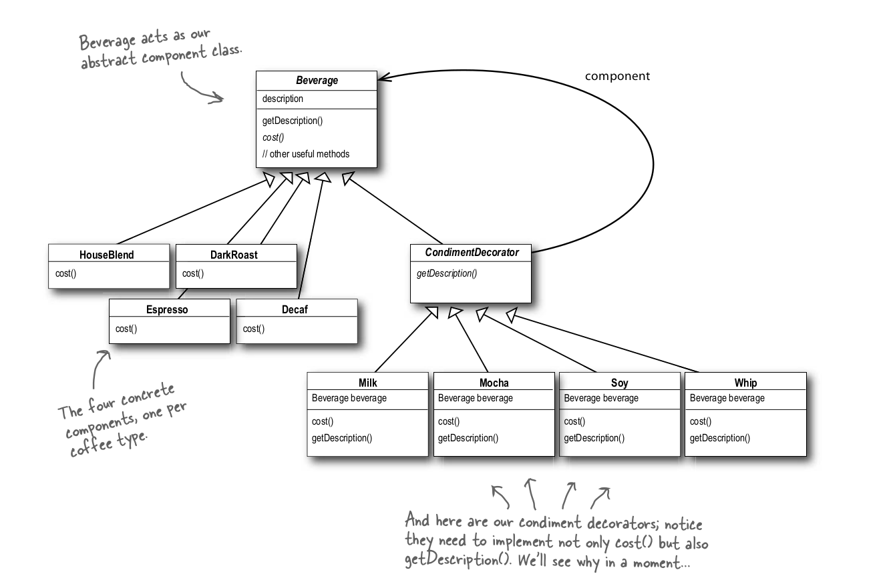

# Decorator Pattern

`The Decorator Pattern attaches additional responsibilities to an object dynamically. Decorators provide a flexible alternative to subclassing for extending functionality.`

Insetad of extending sub classes for new behaviour implementation, we can do incremental adding of behaviour by decorating the class object with decorator.

Beverage example

Consider we have base class Beverage with cost() method for implementation. When we make HouseBlend type of beverage it will be extending from base Beverage class and implement a cost function. when we need to add different toppings or extra cream for the beverage we will need to create a new class for the same "HouseBlend_with_cream" this is a problem as we will keep on making new classes for all different toppings and beverages.

Soultion is to create a decorator class of cream which will take Beverage type of object and call cost on the base object and add extra cost to this to return added cream cost of the beverage. This is adding extra functionality to the same class by decorating it with other object. This is decorator pattern.

