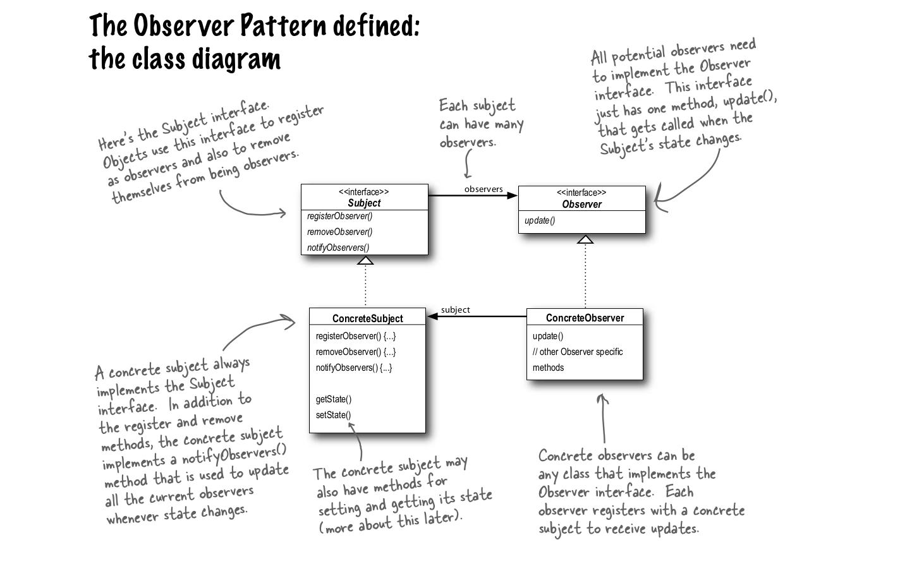

# Observer Pattern 

`Observer is a behavioral design pattern that lets you define a subscription mechanism to notify multiple objects about any events that happen to the object they’re observing.`

Weather Station example

Consider you have a weather station which monitors weather and stores weather data. You have 2 apps or display windows where you display the weather info. 

Push vs Poll

Now every second you will need to poll(keep asking for new info) to weather station for new data. If there are multiple devices doing the same then every second there will be multiple calls.

Observer pattern solves this  by pushing new info to the devices only when data changes.

The display devices are observers and weather station is the observable or subject (state that is observed).

The weather station will store info of all the devices who need to know the state changes when available. It will have functions that will facilitate this behaviour.

