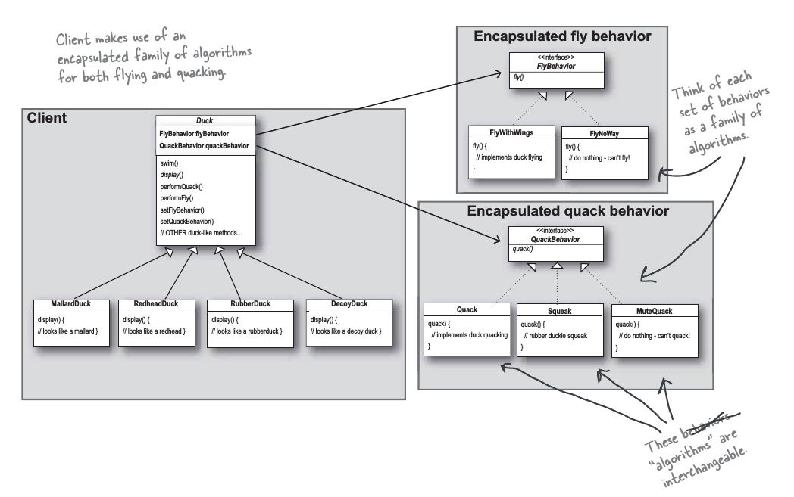

# Strategy Pattern 

`Strategy pattern lets you define a family of algorithms, put each of them into a separate class, and make their objects interchangeable `

instead of writing concret class utilize composition to change the behaviour of the object at client side or run time. 

Duck example

Duck base class will have fly behaviour and quack behaviour. Making new Ducks will result in many new subclasses. Use same interface but different concerete interface implementation which can be interchanged in new class. This way you will have same Duck base class and same execution methods like fly() or quack() but the internal implementation will differ depending on type of interface implementation used.

These new interface implementation will be passed as constructor parameters to Duck Class while instansiating.

